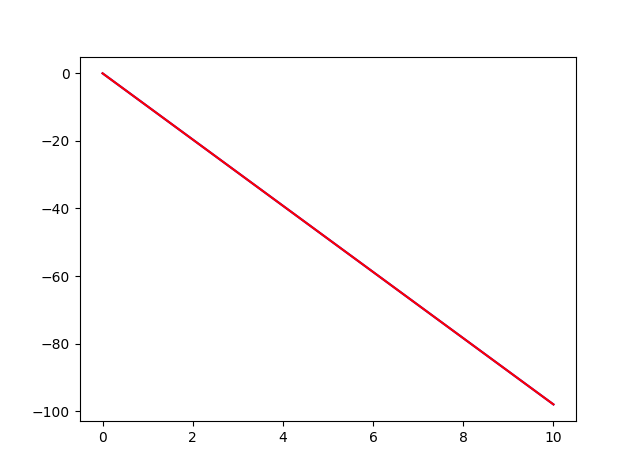
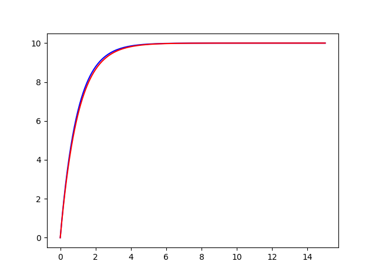
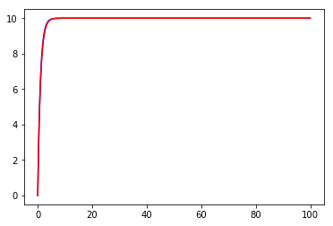

CHAPTER ONE

## 计算方法简介：

- 欧拉法(Euler method/forward Euler method) 是一个一阶数值解初值确定的常微分方程(ODE)的方法。欧拉法是一个一阶的数值方法，其局域误差（每一步的误差）正比于步长的平方，全局误差（在给定时间的最终误差）正比于步长。

- 以粒子衰变为例，其满足的微分方程为：

  $\frac{dN_U}{dt}=-\frac{N_U}{\tau}$

  如果我们将$N_U$在$t$作Taylor展开并忽略二阶及以上的高阶项，则有：

  $N_U(t+\Delta t)\approx N_U(t)+\frac{dN_U}{dt}\Delta t$

  根据已知的微分方程，可知：

  $N_U(t+\Delta t)\approx N_U(t)-\frac{N_U}{\tau}\Delta t$

  近似为：$N_U(t+\Delta t)\approx N_U(t)-\frac{N_U(t)}{\tau}\Delta t$

  将上式作迭代，我们可以通过数值方法得到$N_U$在某一时刻的数值。

  由于该微分方程恰好可以精确求得解析解，因此我们可以比较数值解的最终结果和解析解的相对误差，从而评估我们的计算方法。

  ​

### 课后练习：

### 1.1

#### 算法：

- 根据微分方程$\frac{dv}{dt}=-g$， 利用欧拉法可以得到如下的迭代式：

  $v[t+\Delta t] = v[t] -g\Delta t$

  由于速度的导数为一个常数，因此做Taylor展开只到一阶项为止。由因为g为一个常数，因此迭代过程中不存在近似，因此我们可以预测到数值解应该与解析解完全一致。

- 直接解析求解该微分方程可得，$v(t)=-gt$

#### 源代码：

[作业1.1源码](https://raw.githubusercontent.com/X-sc-fan/computationalphysics_N2015301020074/master/ChapterOne/mat.py)

####  计算结果：

此图中我们分别绘制了解析计算和数值计算结果的$v-t$关系图，两条直线互相重合了。从图中可见，两种计算结果相一致。这里我们列出所选步长不同所得到的不同计算结果：

|      |   解析解    |    数值$\Delta t=0.1$     |   数值$\Delta t=0.01$    |   数值$\Delta t=0.001$    |
| :--: | :------: | :---------------------: | :--------------------: | :---------------------: |
| $v$  | $-98m/s$ | $-98.00000000000004m/s$ | $-97.9999999999992m/s$ | $-97.99999999998754m/s$ |

如果在三位小数的精确范围内，我们的数值计算结果与解析结果完全一致。但是可以看见，随着调整步长，小数点后十位数字之后的结果出现波动，不知道是不是由机器精度所引起的？

### 1.3

#### 算法：

- 其运动微分方程满足：$\frac{dv}{dt}=a-bv$，用欧拉法计算，满足：

  $v[t+\Delta t] = v[t] -(a-b\times v[t])\Delta t$

  由此式迭代仍可以得到相应的数值结果。

- 此微分方程解析求解得到：$v(t)=-\frac{a}{b}\times e^{-bt}+\frac{a}{b}$

#### 源代码：

#### 计算结果：

上两图分别是模拟到15s和100s的结果，步长为0.1s。

图中蓝线是数值计算结果，红线是解析计算结果。可以看见最终速度趋向一个常数。

|           |                   解析解                    | 数值$\Delta t=0.1$  | 数值$\Delta t=0.01$ | 数值$\Delta t=0.001$ |
| :-------: | :--------------------------------------: | :---------------: | :---------------: | :----------------: |
| $v(100s)$ |  $v(t)=-10\times e^{-100}+10\approx 10$  | 9.999999999999993 | 9.999999999999911 | 9.999999999999112  |
| $v(15s)$  | $v(t)=-10\times e^{-15}+10\approx 9.999996940976795$ | 9.999998631085209 | 9.99999716344051  | 9.999996963848844  |

可以从结果看出：当$t\rightarrow\infty$时，$v$无限趋于$10m/s$ 。计算 $15s$时速度时可以看见，步长越短数值解与解析解越接近。但计算计算 $100s$时上述规律似乎并不满足。